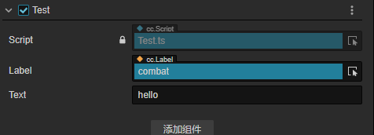
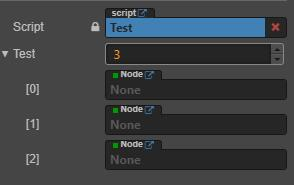
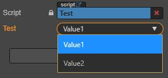
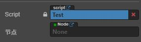
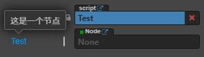
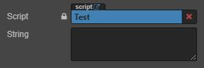
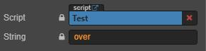

##基本语法结构
``` ts
    let 变量名: 类型 = 初始值
    
    ts 类型
    ts 的常用基础类型分为两种： js 已有类型
    
    原始类型：number/string/boolean/null/undefined/symbol
    对象类型：object（包括，数组、对象、函数等对象）
    
    ts 新增类型
    联合类型（联合类型使用“|"分隔每个类型,比如string | number）
    自定义类型(类型别名)
    接口（用于约束对象、函数、类的契约（标准），代码约束，
    强标准：在代码中使用的标准就是接口：interface）
    元组（固定长度的数组）
    字面量类型（将一个字面量当成一个类型使用。）
    枚举（常用于数据的映射）
    void（表示没有任何类型）
    any（任意类型）
    ts修饰符
    public 定义类的变量默认就是公共的，继承的子类可以通过this来访问
    private 定义类的私有属性，只能在内部访问
    protected: 在类的内部和子类中可以访问,在外面就访问不到了
```
##生命周期 
``` ts
    construct    新建时触发，整个生命周期只会触发一次
    onLoad       节点激活时触发，整个生命周期只会触发一次
    start        节点第一次激活时触发，在update之前，整个生命周期只会触发一次
    update       动画、物理、粒子等渲染前执行，每帧调用
    lateUpdate   动画、物理、粒子等渲染后执行，每帧调用
    onDestroy    销毁时执行，整个生命周期只会触发一次
    onEnable     组件enabled从false变为true，或者节点active从false变为true触发
    onDisable    组件enabled从true变为false，或者节点active从ture变为false触发
```
##节点操作
``` ts 
    //切换场景
    director.loadScene("MyScene")
    
    //获取节点
    find(节点路径)
    
    //获取节点组件，获取脚本前先引入脚本
    this.getComponent（组件名或脚本）
    //通过名称获取节点的子节点
    this.node.getChildByName('节点名称');
    
    //清空所有子元素
    this.node.destroyAllChildren()（）
    
    //加载资源,所有需要通过 loader.loadRes 动态加载的资源，都必须放置在     resources 文件夹或它的子文件夹下。
    loader.loadRes(路径，类型，回调(res,clip))
    //loader.loadRes类型参数（类型可以不填）
    //AudioClip（）（音频资源类）
    
    //节点事件
    this.node.on()（绑定事件）
    Node.EventType.TOUCH_START（当手指触摸到屏幕时，点击事件）
    Node.EventType.TOUCH_MOVE（当手指在屏幕上移动时。）
    Node.EventType.TOUCH_END(当手指在目标节点区域内离开屏幕时)
    
    //坐标操作
    
    this.node.convertToWorldSpaceAR()(将节点坐标系下的一个点转换到世界空间坐标)
    this.node.convertToNodeSpaceAR()(将一个点转换到节点 (局部) 空间坐标系)
    sub(向量减法，并返回新结果。)
    var v = v2(10, 10);
    v.sub(v2(5, 5));      // return Vec2 {x: 5, y: 5};
```
##音频操作
音频组件，代表单个音源，提供播放、暂停、停止等基本功能。
https://docs.cocos.com/creator/3.6/api/zh/class/AudioSource?id=%e7%b1%bb-audiosource
**导入示例**
``` ts
import { AudioSource } from "cc";
```
**构造函数**
- AudioSource public

**静态属性**
- maxAudioChannel static
- EventType static
- AudioState static

**属性**
- **volume public** 音频的音量（大小范围为 0.0 到 1.0）。
请注意，在某些平台上，音量控制可能不起效。
- **state public** 获取当前音频状态。
- **playing public** 当前音频是否正在播放？
- **playOnAwake public**
是否启用自动播放。
请注意，根据最新的自动播放策略，现在对大多数平台，自动播放只会在第一次收到用户输入后生效。
参考：https://www.chromium.org/audio-video/autoplay
- **loop public** 是否循环播放音频？
- **duration public** 获取以秒为单位的音频总时长。
- **currentTime public** 以秒为单位获取当前播放时间。
- **clip public** 设定要播放的音频。
- **_clip protected**
- **_loop protected**
- **_playOnAwake protected**
- **_player protected**
- **_volume protected**

**方法**
- **stop public** 停止播放。
- **playOneShot public** 以指定音量倍数播放一个音频一次。最终播放的音量为 `audioSource。volume * volumeScale`。
- **play public** 开始播放。
  - 如果音频处于正在播放状态，将会重新开始播放音频。
  - 如果音频处于暂停状态，则会继续播放音频。
  - 注意:在 Web 平台，Auto Play Policy 禁止首次自动播放音频，因为需要发生用户交互之后才能播放音频。
  - 有两种方式实现音频首次自动播放：
    - 在 TOUCH_END 或者 MOUSE_UP 的事件回调里播放音频。
    - 直接播放音频，引擎会在下一次发生用户交互时自动播放。
- **pause public** 暂停播放。
- **getSampleRate public** 获取音频的采样率。目前仅在原生平台和 Web Audio（包括 Web 和 字节平台）中可用。
- **getPCMData public** 通过指定的通道获取音频的 PCM data。目前仅在原生平台和 Web Audio（包括 Web 和 字节平台）中可用。
-  **_syncStates protected**

##面板可视化
###@property()
**声明类的属性**
是组件类时，需要在括号添加组件名称，不加不会出现在检查器面板中
``` ts
    @property(Label)//添加类的属性，非基础类型，是组件类，所以需要添加（Label）
    label: Label = null;
    @property//添加类的属性，基础类，不需要添加（）
    text: string = 'hello';
```

- **数组**
```ts
    //数组
    @property({ type: cc.Node })
    private test: cc.Node[] = [];
    //or
    @property([cc.Node])
    private test: cc.Node[] = [];
```

- **如果将 type 设置为枚举，则在属性编辑器中会显示一个下拉框**
``` ts
    enum TestEnum {
      Value1 = 0,
      Value2 = 1
    }
@property({ type: cc.Enum(TestEnum) })
private test: TestEnum = TestEnum.Value1;
```


- **visible 在 属性性检查器 中显示或隐藏**
``` ts
    isShow: boolean = false;
    @property({ type: cc.Node, visible() { return this.isShow; } })
    test: cc.Node = null;
```
- **displayName 在 属性检查器 中显示为另一个名字**

``` ts
    @property({ type: cc.Node, displayName: "节点" })
    test: cc.Node = null;
```

- **tooltip 在 属性检查器 中添加属性的 Tooltip，将鼠标悬浮于属性上会出现对应的字符串**
``` ts
    @property({ type: cc.Node, tooltip: "这是一个节点" })
    test: cc.Node = null;
```

- **multiline 在 属性检查器 中使用多行文本框**
``` ts
    @property({ multiline: true })
    private string: string = "";
```

- **readonly 在 属性检查器 中只读**

``` ts
    @property({ readonly: true })
    private string: string = "over";
```


- **min 限定数值在编辑器中输入的最小值/最大值**

``` ts
    @property({ min: 0 })
    private index_min: number = 0;
    @property({ max: 1 })
    private index_max: number = 0;
```
- **step 指定数值在编辑器中调节的步长**
``` ts
    @property({ step: 1 })
    private index: number = 0;
```
- **range 一次性设置 min, max, step**
``` ts
    @property({ range: [0, 1, 1] })
    private index: number = 0;
```
- **slide 在 属性检查器 中显示为滑动条，需要设置 max 及 min， step用于键盘的上下控制，手动划滑块是默认0.1**
``` ts
    @property({ slide: true, min: 0, max: 10, step: 1 })
    private index: number = 0;
```
##tsconfig.js
TypeScript 使用 tsconfig.json 文件作为其配置文件，当一个目录中存在 tsconfig.json 文件，则认为该目录为 TypeScript 项目的根目录。
通常 tsconfig.json 文件主要包含两部分内容：指定待编译文件和定义编译选项。
**顶层属性**
  - compileOnSave
  - compilerOptions
  - exclude
  - extends
  - files
  - include
  - references
  - typeAcquisition
  


**使用 tsconfig.json**

目前使用 tsconfig.json 有2种操作：

**1. 初始化 tsconfig.json**

在初始化操作，也有 2 种方式：


- 手动在项目根目录（或其他）创建 tsconfig.json 文件并填写配置；

- 通过 tsc --init 初始化 tsconfig.json 文件。


**2. 指定需要编译的目录**

在不指定输入文件的情况下执行 tsc 命令，默认从当前目录开始编译，编译所有 .ts 文件，并且从当前目录开始查找 tsconfig.json 文件，并逐级向上级目录搜索。

**$ tsc**

另外也可以为 tsc 命令指定参数 --project 或 -p 指定需要编译的目录，该目录需要包含一个 tsconfig.json 文件，如：
``` ts
/*
  文件目录：
  ├─src/
  │  ├─index.ts
  │  └─tsconfig.json
  ├─package.json
*/
$ tsc --project src
```
注意，tsc 的命令行选项具有优先级，会覆盖 tsconfig.json 中的同名选项。 
**常用的配置**

``` ts
{
  // ...
  "compilerOptions": {
    "incremental": true, // TS编译器在第一次编译之后会生成一个存储编译信息的文件，第二次编译会在第一次的基础上进行增量编译，可以提高编译的速度
    "tsBuildInfoFile": "./buildFile", // 增量编译文件的存储位置
    "diagnostics": true, // 打印诊断信息 
    "target": "ES5", // 目标语言的版本
    "module": "CommonJS", // 生成代码的模板标准
    "outFile": "./app.js", // 将多个相互依赖的文件生成一个文件，可以用在AMD模块中，即开启时应设置"module": "AMD",
    "lib": ["DOM", "ES2015", "ScriptHost", "ES2019.Array"], // TS需要引用的库，即声明文件，es5 默认引用dom、es5、scripthost,如需要使用es的高级版本特性，通常都需要配置，如es8的数组新特性需要引入"ES2019.Array",
    "allowJS": true, // 允许编译器编译JS，JSX文件
    "checkJs": true, // 允许在JS文件中报错，通常与allowJS一起使用
    "outDir": "./dist", // 指定输出目录
    "rootDir": "./", // 指定输出文件目录(用于输出)，用于控制输出目录结构
    "declaration": true, // 生成声明文件，开启后会自动生成声明文件
    "declarationDir": "./file", // 指定生成声明文件存放目录
    "emitDeclarationOnly": true, // 只生成声明文件，而不会生成js文件
    "sourceMap": true, // 生成目标文件的sourceMap文件
    "inlineSourceMap": true, // 生成目标文件的inline SourceMap，inline SourceMap会包含在生成的js文件中
    "declarationMap": true, // 为声明文件生成sourceMap
    "typeRoots": [], // 声明文件目录，默认时node_modules/@types
    "types": [], // 加载的声明文件包
    "removeComments":true, // 删除注释 
    "noEmit": true, // 不输出文件,即编译后不会生成任何js文件
    "noEmitOnError": true, // 发送错误时不输出任何文件
    "noEmitHelpers": true, // 不生成helper函数，减小体积，需要额外安装，常配合importHelpers一起使用
    "importHelpers": true, // 通过tslib引入helper函数，文件必须是模块
    "downlevelIteration": true, // 降级遍历器实现，如果目标源是es3/5，那么遍历器会有降级的实现
    "strict": true, // 开启所有严格的类型检查
    "alwaysStrict": true, // 在代码中注入'use strict'
    "noImplicitAny": true, // 不允许隐式的any类型
    "strictNullChecks": true, // 不允许把null、undefined赋值给其他类型的变量
    "strictFunctionTypes": true, // 不允许函数参数双向协变
    "strictPropertyInitialization": true, // 类的实例属性必须初始化
    "strictBindCallApply": true, // 严格的bind/call/apply检查
    "noImplicitThis": true, // 不允许this有隐式的any类型
    "noUnusedLocals": true, // 检查只声明、未使用的局部变量(只提示不报错)
    "noUnusedParameters": true, // 检查未使用的函数参数(只提示不报错)
    "noFallthroughCasesInSwitch": true, // 防止switch语句贯穿(即如果没有break语句后面不会执行)
    "noImplicitReturns": true, //每个分支都会有返回值
    "esModuleInterop": true, // 允许export=导出，由import from 导入
    "allowUmdGlobalAccess": true, // 允许在模块中全局变量的方式访问umd模块
    "moduleResolution": "node", // 模块解析策略，ts默认用node的解析策略，即相对的方式导入
    "baseUrl": "./", // 解析非相对模块的基地址，默认是当前目录
    "paths": { // 路径映射，相对于baseUrl
      // 如使用jq时不想使用默认版本，而需要手动指定版本，可进行如下配置
      "jquery": ["node_modules/jquery/dist/jquery.min.js"]
    },
    "rootDirs": ["src","out"], // 将多个目录放在一个虚拟目录下，用于运行时，即编译后引入文件的位置可能发生变化，这也设置可以虚拟src和out在同一个目录下，不用再去改变路径也不会报错
    "listEmittedFiles": true, // 打印输出文件
    "listFiles": true// 打印编译的文件(包括引用的声明文件)
  }
}
```
**3. exclude**

exclude 属性作用是指定编译器需要排除的文件或文件夹。
默认排除 node_modules 文件夹下文件。
``` ts
{
	// ...
  "exclude": [
    "src/lib" // 排除src目录下的lib文件夹下的文件不会编译
  ]
}
```
和 include 属性一样，支持 glob 通配符：
```
* 匹配0或多个字符（不包括目录分隔符）
? 匹配一个任意字符（不包括目录分隔符）
**/ 递归匹配任意子目录
```

**extends**

extends 属性作用是引入其他配置文件，继承配置。
默认包含当前目录和子目录下所有 TypeScript 文件。
``` ts
{
	// ...
    // 把基础配置抽离成tsconfig.base.json文件，然后引入
	"extends": "./tsconfig.base.json"
}
```
**files**

files 属性作用是指定需要编译的单个文件列表。
默认包含当前目录和子目录下所有 TypeScript 文件。
``` ts
{
	// ...
  "files": [
    // 指定编译文件是src目录下的leo.ts文件
    "scr/leo.ts"
  ]
}
```
**include**

include 属性作用是指定编译需要编译的文件或目录。
``` ts
{
	// ...
  "include": [
    // "scr" // 会编译src目录下的所有文件，包括子目录
    // "scr/*" // 只会编译scr一级目录下的文件
    "scr/*/*" // 只会编译scr二级目录下的文件
  ]
}
```
**references**

references 属性作用是指定工程引用依赖。
在项目开发中，有时候我们为了方便将前端项目和后端node项目放在同一个目录下开发，两个项目依赖同一个配置文件和通用文件，但我们希望前后端项目进行灵活的分别打包，那么我们可以进行如下配置：
``` ts
{
	// ...
  "references": [ // 指定依赖的工程
     {"path": "./common"}
  ]
}
```
**typeAcquisition**

typeAcquisition 属性作用是设置自动引入库类型定义文件(.d.ts)相关。
包含 3 个子属性：
- **enable** : 布尔类型，是否开启自动引入库类型定义文件(.d.ts)，默认为 false；
- **nclude** : 数组类型，允许自动引入的库名，如：[“jquery”, “lodash”]；
- **exculde** : 数组类型，排除的库名。
``` ts
{
	// ...
  "typeAcquisition": {
    "enable": false,
    "exclude": ["jquery"],
    "include": ["jest"]
  }
}
```

